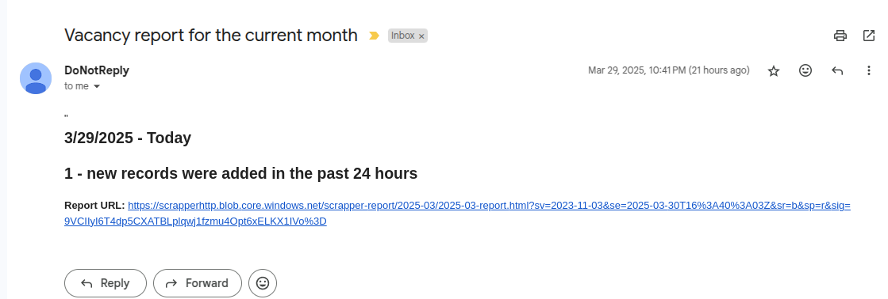

# kowto

## Overview
The ```kowto``` is a C# project designed to work with Azure Functions. It includes functionality for interacting with Azure Cosmos DB and Logic Apps.

## Idea
In this project at this stage, there is one simple function - to notify me when a new vacancy appears on the DOU and Djinni website. Every 2 hour between 6:00 and 22:00 (UTC) from mMnday to Friday the function makes a query on DOU with the specified filter and loads information about vacancies. Compares with the values ​​in the database and if there are new vacancies, it calls a logic application that sends an email with information about the new vacancy


Also collecting statistics on vacancies per month (while the functionality is in its initial stage of existence). An example can be viewed at the link (https://scrapperhttp.blob.core.windows.net/scrapper-report/2025-03/2025-03-report.html?sas-Opt6xELKX1IVo%3D the data is not accurate as a result of testing the functionality and url will be expired at this time already)



The report can also be viewed on the organization's GitHub page https://kowto-app.github.io/ (hosted using github pages on repo https://github.com/kowto-app/kowto-app.github.io)


## Key Features
- Azure Functions Integration: The project is built using Azure Functions, making it scalable and efficient for serverless applications.
- Cosmos DB Integration: It includes a Cosmos DB container and wrapper for database operations.
- Azure Blob Storage: Public blob for storing reports.
- Logic App Workflow: The project interacts with Azure Logic Apps through a specified workflow URL.
- Application Insights: Integration with Application Insights for monitoring and diagnostics.
- Email Communication Service: Sending emails from Logic App
- Github api integration: updating report page hosted on github pages
## Setup Instructions
1. **Clone the repository:**

```bash
git clone https://github.com/MykhailoRospopchuk/kowto.git
```

2. **Navigate to the project directory and configure the environment variables:**

- LogicAppWorkflowURL: URL for the Logic App Workflow.
- CosmoConnectionString: Connection string for Cosmos DB.
- ```local.settings.json``` should contains this variables
```json
{
  "IsEncrypted": false,
  "Values": {
    "AzureWebJobsStorage": "",
    "FUNCTIONS_WORKER_RUNTIME": "",
    "APPLICATIONINSIGHTS_CONNECTION_STRING": "",
    "DEPLOYMENT_STORAGE_CONNECTION_STRING": "",
    "CosmoConnectionString": "",
    "FUNCTIONS_EXTENSION_VERSION": "",
    "WEBSITE_USE_PLACEHOLDER_DOTNETISOLATED": "",
    "AZURE_FUNCTIONS_ENVIRONMENT": "Production",
    "CommunicationLogicApp": "",
    "AZURE_BLOB_CONTAINER_URI": "",
    "AZURE_BLOB_STORAGE_ACCOUNT_NAME": "",
    "AZURE_BLOB_STORAGE_ACCOUNT_KEY": "",
    "GitHubKowtoAppPAT": ""
  }
}
```

1. **As you already understand you need set up your NO-SQL database (CosmoDB in this our case) and create simple Azure Logic App**

As I have already discovered "through scientific trial and error," if you use Outlook mail, it can be temporarily blocked if you send a message once an hour.

So I tried another option using Azure Communication Service with Email Communication Service. You can create default azure managed domain ```DoNotReplay@************azurecomm.net``` (and as expect it will go in spam folder on mailbox). But it works


1. **Build and run the project:**

```bash
func start
```
5. In order for the **VacancyScrapper** function to be able to process vacancies - you need to register vacancy sources. You can manually enter them into the database. Or you can use the second **ResourceRegistration** function which is designed to add and remove the configuration of vacancy sources. Since the function has an authorization level of function, you must specify the ```x-functions-key``` key in the request headers
```json
{
    "DeleteRecordIds": [],
    "Resources": [
        {
            "Path": 1,
            "Params": [
                {
                    "Key": "category",
                    "Value": ".NET"
                },
                {
                    "Key": "exp",
                    "Value": "1-3"
                }
            ]
        },
        {
            "Path": 2,
            "Params": [
                {
                    "Key": "primary_keyword",
                    "Value": ".NET"
                },
                {
                    "Key": "primary_keyword",
                    "Value": "Dotnet Cloud"
                },
                {
                    "Key": "primary_keyword",
                    "Value": "Dotnet Web"
                },
                {
                    "Key": "primary_keyword",
                    "Value": "ASP.NET"
                },
                {
                    "Key": "primary_keyword",
                    "Value": "Blazor"
                },
                {
                    "Key": "exp_level",
                    "Value": "1y"
                },
                {
                    "Key": "exp_level",
                    "Value": "2y"
                }
            ]
        }
    ]
}
```
## Usage
The project provides Azure Functions that interact with Cosmos DB and Logic Apps. Ensure that the necessary environment variables are set before running the application.

Contribution Guidelines
Contributions are welcome! Please fork the repository and submit pull requests for any enhancements or bug fixes.

Feel free to adjust the review based on any additional details or specific features you want to highlight in your project.